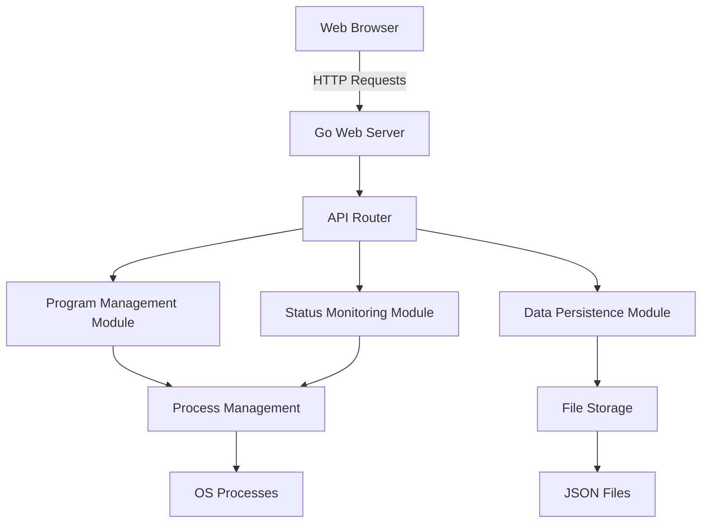

# Architecture Overview

## Project Summary

The Program Manager is a web-based tool designed for managing executable programs and shell scripts on Linux platforms. It provides a user-friendly interface for adding, removing, starting, stopping, and monitoring programs, with data persistence and import/export capabilities.

## Key Features

1. **Program Management**: Add, edit, delete programs with detailed information
2. **Status Monitoring**: Real-time monitoring of program execution status
3. **Process Control**: Start and stop programs with proper process management
4. **Batch Operations**: Perform actions on multiple programs simultaneously
5. **Data Persistence**: Store program information in JSON files with import/export
6. **Web Interface**: Responsive web UI for easy management

## System Architecture

The application follows a layered architecture with clear separation of concerns:

### Architecture Layers

1. **Presentation Layer**: 
   - Web UI built with HTML, CSS, and JavaScript
   - Responsive design for various screen sizes
   - Real-time status updates

2. **Application Layer**:
   - Go web server with RESTful API endpoints
   - Request routing and middleware
   - Error handling and logging

3. **Business Logic Layer**:
   - Program management services
   - Status monitoring services
   - Process control services

4. **Data Access Layer**:
   - File storage implementation
   - JSON serialization/deserialization
   - Data validation

5. **System Interface Layer**:
   - Process management utilities
   - File system operations
   - OS-specific functionality

## Technology Stack

### Backend
- **Language**: Go (Golang)
- **Web Framework**: Standard library `net/http` package
- **JSON Handling**: Standard library `encoding/json` package
- **Process Management**: Standard library `os/exec` package
- **File I/O**: Standard library `os` and `io` packages

### Frontend
- **HTML5**: Structure and content
- **CSS3**: Styling and layout (with Flexbox and Grid)
- **JavaScript**: Interactivity and API communication
- **Responsive Design**: Media queries and flexible layouts

### Data Storage
- **Format**: JSON
- **Storage**: Local file system
- **Persistence**: Atomic file operations

## Core Components

### Program Model
Represents an executable program or shell script with properties:
- Unique ID
- Name
- Execution command
- Working directory
- Description
- Status (running/stopped)
- Process ID

### Program Manager
Manages a collection of programs and provides operations:
- Add/remove programs
- Update program information
- Retrieve program list

### Process Manager
Handles execution and control of programs:
- Start programs in background
- Stop programs and clean up processes
- Generate log files
- Validate process status

### Status Monitor
Tracks and updates program execution status:
- Check process existence via `/proc` filesystem
- Validate process identity
- Handle PID reuse scenarios
- Periodic status refresh

### File Storage
Manages data persistence:
- JSON serialization of program data
- Atomic file operations
- Import/export functionality
- Backup and recovery

## Data Flow

1. **User Interaction**:
   - User interacts with web interface
   - JavaScript makes API calls to backend

2. **API Processing**:
   - HTTP requests routed to appropriate handlers
   - Business logic executed
   - Data access layer invoked

3. **Data Operations**:
   - Data retrieved from or saved to JSON files
   - Process management operations executed
   - Status monitoring updates performed

4. **Response Generation**:
   - Results formatted as JSON
   - HTTP responses sent to client

5. **UI Update**:
   - Web interface updated with new data
   - Real-time status indicators refreshed

## Security Considerations

### Process Isolation
- Programs executed with limited privileges
- Working directory validation
- Command injection prevention

### Data Protection
- File permission controls
- Input validation and sanitization
- Secure file operations

### API Security
- Basic authentication
- CSRF protection
- Rate limiting (optional)

## Performance Considerations

### Process Management
- Efficient process checking using `/proc` filesystem
- Concurrent status updates
- Minimal system resource usage

### Data Operations
- Atomic file operations to prevent corruption
- Efficient JSON parsing and generation
- Caching of frequently accessed data

### Web Interface
- Lazy loading of non-critical resources
- Virtual scrolling for large program lists
- Optimized API calls

## Scalability Considerations

### Horizontal Scaling
- Stateless design allows multiple instances
- Shared file system or database for data storage
- Load balancing for web interface

### Vertical Scaling
- Efficient resource usage
- Configurable refresh intervals
- Batch operations for better performance

## Deployment Considerations

### System Requirements
- Linux operating system
- Go runtime environment
- Sufficient disk space for log files
- Appropriate user permissions

### Installation
- Single binary deployment
- Configuration file for customization
- Systemd service file for automatic startup

### Monitoring
- Built-in status monitoring
- Log file generation
- Health check endpoints

## Future Enhancements

### Advanced Features
- User authentication and authorization
- Program scheduling (cron-like functionality)
- Resource usage monitoring
- Notification system for status changes

### Performance Improvements
- Database backend for large deployments
- Caching layer for improved response times
- WebSocket support for real-time updates

### Usability Enhancements
- Mobile application
- CLI interface
- Plugin system for custom functionality