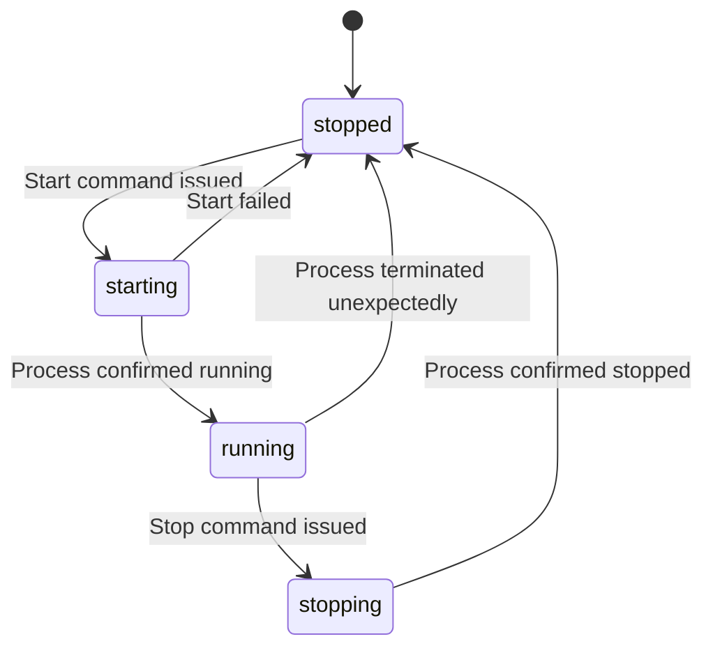

# Status Monitoring Mechanism

## Overview

The status monitoring mechanism is responsible for tracking the execution state of managed programs. It provides real-time information about whether programs are running or stopped, and ensures that the application's internal state accurately reflects the actual system state.

## Process Status Detection

### Linux Process Checking

On Linux systems, the application uses the `/proc` filesystem to check process status:

1. **Process Existence**: Check if `/proc/{pid}` directory exists
2. **Process Validation**: Verify that the process at the given PID is actually the expected program

### Process Validation Steps

1. Read the process command line from `/proc/{pid}/cmdline`
2. Compare with the stored command for the program
3. If they match, the process is valid
4. If they don't match, the process is considered invalid (PID reused)

### Edge Cases Handling

1. **PID Reuse**: When a process terminates and the OS reuses its PID for a different process
2. **Permission Issues**: When the application doesn't have permission to access `/proc/{pid}`
3. **Zombie Processes**: Processes that have terminated but not yet cleaned up by their parent
4. **Orphaned Processes**: Processes whose parent has died

## Status Refresh Mechanism

### Manual Refresh

Users can trigger a manual refresh through:
- Web UI button
- API endpoint (`POST /api/programs/refresh`)

When a manual refresh is triggered:
1. Iterate through all programs in the list
2. For each program with a non-zero PID:
   - Check if the process exists and is valid
   - Update the program's status accordingly
3. Save the updated program list

### Automatic Refresh

The application can optionally perform automatic periodic refreshes:
- Configurable interval (default: 30 seconds)
- Background goroutine that periodically checks statuses
- Updates only programs with non-zero PIDs

### Refresh Strategies

1. **Individual Refresh**: Check status of a single program
2. **Batch Refresh**: Check status of all programs
3. **Selective Refresh**: Check status of only programs that might have changed

## Status Representation

### Status Values

| Status | Description |
|--------|-------------|
| running | Program is currently executing |
| stopped | Program is not running |
| starting | Program is in the process of starting |
| stopping | Program is in the process of stopping |

### Status Transitions

## Performance Considerations

### Efficient Process Checking

1. **Caching**: Cache process information to avoid repeated system calls
2. **Batching**: Check multiple processes in a single operation when possible
3. **Parallel Processing**: Use goroutines to check multiple processes concurrently

### Resource Usage

1. **CPU**: Minimize CPU usage during status checks
2. **Memory**: Efficiently manage memory for process information
3. **File Descriptors**: Properly close file descriptors after use

## Error Handling

### Process Check Errors

1. **Permission Denied**: Log error and mark process status as unknown
2. **Process Not Found**: Update status to stopped and clear PID
3. **File System Errors**: Retry operation with exponential backoff

### Recovery Mechanisms

1. **Retry Logic**: Retry failed operations with backoff
2. **Fallback Methods**: Use alternative methods if primary method fails
3. **Graceful Degradation**: Continue operating with reduced functionality

## Integration with Other Components

### Program Management

1. When starting a program:
   - Set status to "starting"
   - After successful start, update to "running" and set PID
2. When stopping a program:
   - Set status to "stopping"
   - After successful stop, update to "stopped" and clear PID

### Data Persistence

1. Status information is saved to the data file
2. On application restart, programs are initially marked as "stopped"
3. A refresh is performed on startup to determine actual status

### Web Interface

1. Real-time status updates through WebSockets or periodic polling
2. Visual indicators for different status values
3. Manual refresh capability

## Testing Considerations

### Unit Tests

1. Process validation logic
2. Status transition logic
3. Error handling scenarios

### Integration Tests

1. End-to-end status monitoring
2. Interaction with process management
3. Data persistence of status information

### Performance Tests

1. Large number of programs
2. High frequency status checks
3. Concurrent operations

## Security Considerations

### Process Access

1. Only access processes that the application manages
2. Validate process ownership
3. Handle permission errors gracefully

### Data Integrity

1. Ensure status information is accurate
2. Prevent unauthorized status modifications
3. Audit status changes